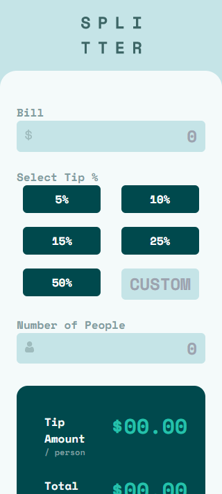
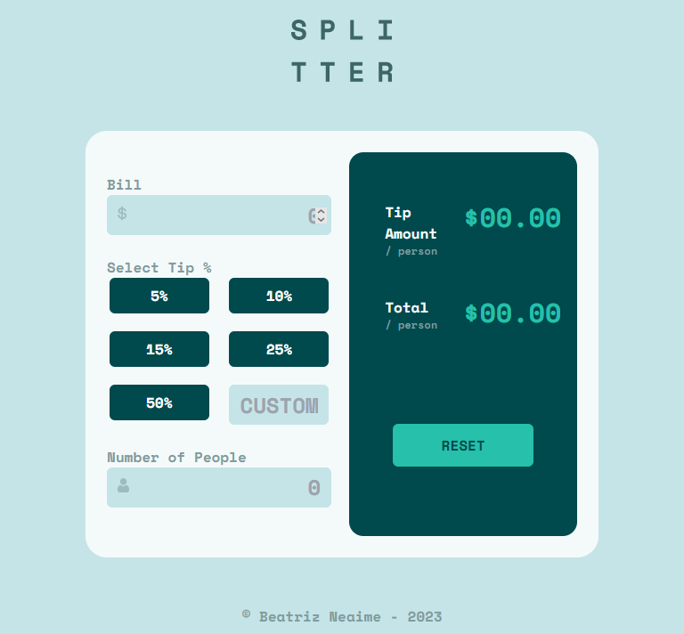
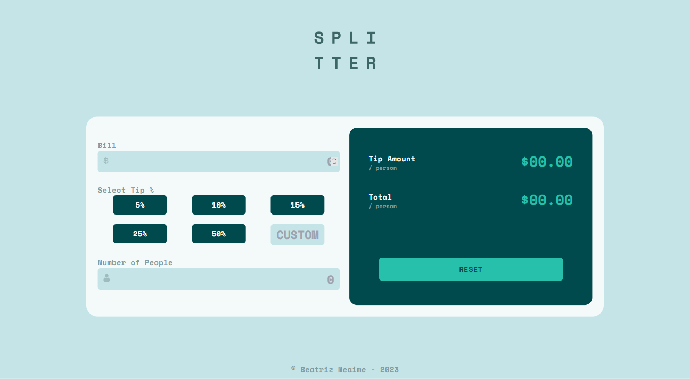

# Frontend Mentor - Tip calculator app solution

This is a solution to the [Tip calculator app challenge on Frontend Mentor](https://www.frontendmentor.io/challenges/tip-calculator-app-ugJNGbJUX). Frontend Mentor challenges help you improve your coding skills by building realistic projects.

## Table of contents

- [Overview](#overview)
  - [The challenge](#the-challenge)
  - [Screenshot](#screenshot)
  - [Links](#links)
- [My process](#my-process)
  - [Built with](#built-with)
  - [What I learned](#what-i-learned)
- [Author](#author)
- [Acknowledgments](#acknowledgments)

## Overview

### The challenge

Users should be able to:

- View the optimal layout for the app depending on their device's screen size
- See hover states for all interactive elements on the page
- Calculate the correct tip and total cost of the bill per person

### Screenshot

How the app behaves when open in a smartphone



How the app behaves when open in a tablet



How the app behaves when open in a desktop


### Links

- Solution URL: [Github](https://www.linkedin.com/in/beatriz-neaime-1564b51b1/)
- Live Site URL: [Add live site URL here](https://your-live-site-url.com)

## My process

### Built with

- Mobile-first workflow
- Flexbox
- [React](https://reactjs.org/)
- [TailwindCSS](https://tailwindcss.com/docs/installation)

### What I learned

While building this project I learned to use global states using 

```js 
createContext();
```
From now on I know a better way to deal with projects that demands the use of shared states. 

## Author

- Website - [BeatrizNeaime](https://beatrizneaime.vercel.app)
- Frontend Mentor - [@BeatrizNeaime](https://www.frontendmentor.io/profile/BeatrizNeaime)
- Linkedin -  [Beatriz Neaime](https://www.linkedin.com/in/beatriz-neaime-1564b51b1/)
## Acknowledgments

Use global states!!!